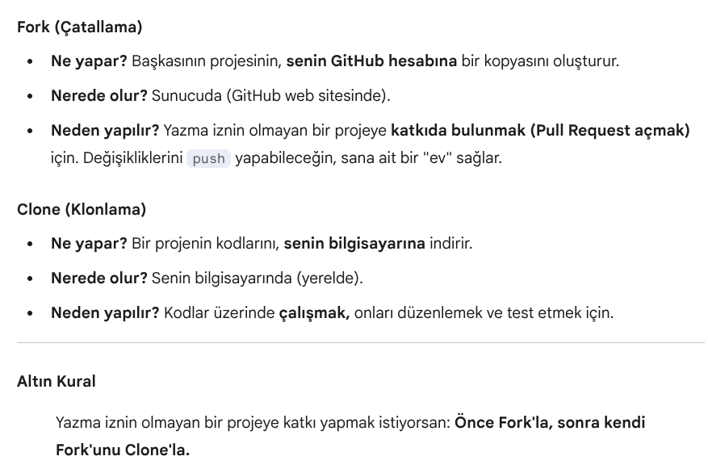
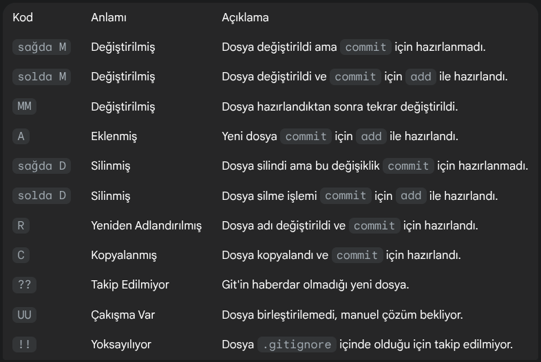
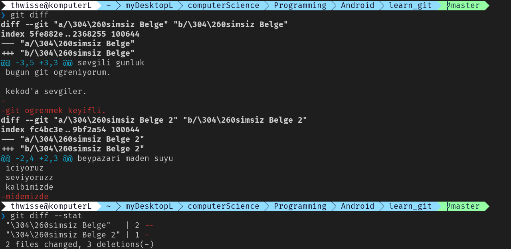
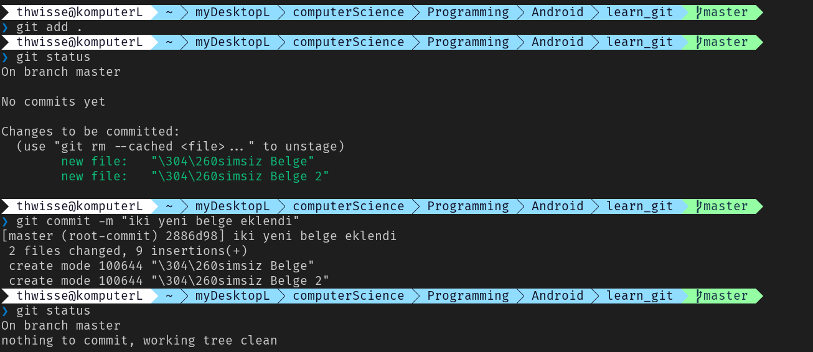
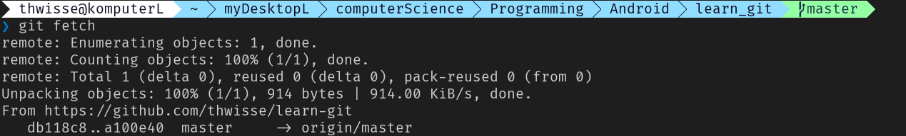
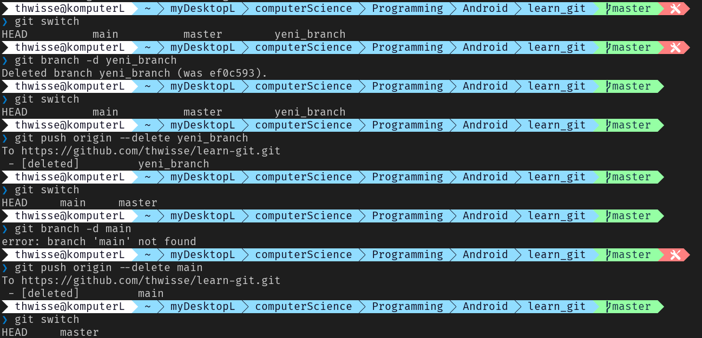

### NOTLAR

- vcs ille de yazilim icin kullanilacak diye bir kural yok. versiyonlanmasi, duzgun takip edilmesi, birden fazla kisinin calismasi gereken vs. sebeplerle her dijital belge icin kullanilabilir.
- main (yani master) de bir branch'tir. `--branch main` mesela bu git clone ile ayni isi yapar.
- 1- localdeki calisilan alan,  2- staging area, 3- commit local repo, 4- push and remote area
	- ![[Pasted image 20250919163432.png]]
- origin = uzaktaki (remote) sunucu. yani ornegin githubdaki repo linki. (tariyicidaki link degil tabii git linki demek istedim)
- genelde buyuk sirketlerde main branch kilitli olur. calisanlarin da kendi branchleri olur. istesen de ana projeye zarar veremezsin.
- HEAD: o an uzerinde calisilan dalin en son commitini isaret eden gostergedir. genelde son atilan commiti isaret eder. bazen o an bagli oldugun aciktaki branch'i isaret ediyor da olabilir.
- never merge alone. conflict'leri diger developerlarla birlikte coz.
- branch degistirecegin zaman bir aliskanlik olarak hep fetch-pull yapmak iyidir.
- fork ile clone farkli seyler. 
	- 

### KOMUTLAR

- `git config --global user.name`
	- git ismini belirlemek
- `git config --global user.email`
	- git email'ini belirlemek
- `git config --global color.ui auto`
	- terminal renklendirmek
	- auto, true, false, always, never
- `git init`
	- bir klasorde git baslatmak (initialize)
- `git init --bare` (nadir kullanilir)
	- working area'si olmayan git yapisi olusturmak
- `git init --template dosya_yolu`
	- working areamiz verilen dosya yolundaki template'le yeniden olusturulur
- `git clone github_linki`
	- githubdaki bir repoyu klonlamak
- `git clone github_linki dosya_yolu`
	- klon islemini verdigim dosya yoluna yap
- `git clone --branch branch_adi github_linki`
	- reponun sadece belli bir branch'ini klonlamak
	- bu sekilde klonlandiginda diger branchlerin gecmisi de yine klonlanir
- `git clone --single-branch branch_adi github_linki`
	- bu sekilde klonlandiginda diger branchlerin gecmisi klonlanmaz
- `git clone --recursive github_linki` (nadir kullanilir)
	- bu sekilde ic ice olan git yapilarini da icerecek sekilde tum git yapisi klonlanabilir. eger varsa tabii. buyuk projelerde git icinde git yapilari kurulabilir. git icindeki git yapilarina sub module deniyor.
- `git status`
	- git yapisi anlik durum
- `git status -s` veya `git status --short`
	- kisa git yapisi durumu.
	- 
- `git add`
	- dosyalari staging area'ya alma isi. degisiklikleri hazirlamak.
	- staging area'yi market sepeti gibi dusun.
- `git add -A` ya da `git add --all`
	- tum dosyalari hazirla. untracked'lari da tracked yapar. projedeki tum dosyalardaki tum degisikleri hazirlar
- `git add .`
	- sadece bulundugun dizin altindaki degisiklileri hazirla.
- `git add *.txt`
	- sadece txt dosyalarini hazirla
- `git add index.html`
	- sadece index.html belgesini ekle
- `git add --update` ya da `git add -u`
	- sadece modified edilmis dosyalari hazirla.
- `git add dosya_yolu`
	- sadece belli bir dizini hazirla.
- `git reset`
	- add islemini yapmadan onceki hale geri almak
	- dosyalarda degisiklik yapmaz. staging area'ya eklenenleri oradan cikarir sadece. hazirlanan degisiklikleri geri alir.
- `git diff`
	- staging area'ya add islemi yapmadan once degisikleri gormek.
	- untracked yani takip edilmeyen dosyalar bunda gozukmez.
- `git diff --stat`
	- hazirlanmamis olan degisikliklerinin kac dosya, kac satir vs oldugunu soyleyen istatislik.
	- 
- `git diff --staged`
	- stage edilmis degisikleri gormek. add islemi yapildiktan sonraki degisikleri gosterir.
- `git commit -m "mesaj"`
	- degisiklikler local repository'e kaydedilir.
	- commit islemi ve commit mesaji. sadece staging area'ya alinan degisikler commit edilebilir. untracked degisiklikler izlenmedigi gibi commit de edilemez.
	- farkli islemler icin farkli commitler ve mesajlar at. farkli islemleri ayni commitle ve mesajla atma. silme, ekleme, degistirme vs. detayli bilgi ver.
	- belli bir commit yapisi kullan. ornegin mesajin basina delete, add, modified vs. keyword girebilirsin. bu yapilara atomic commit denir. bi zaman sonra bunu detayli ogren.
	- 
	- bu henuz push (publish) edilmemis halidir. yani uzak sunucuya gonderilmedi sadece localde commit edildi yani gonderilmeye haphazir.
- `git commit -a - m "mesaj"`
	- daha once add ile eklenmis bir degisikligi tekrar add yapmadan direkt commit etmek istersen -a ekleyerek direkt hem add hem commit edebiliyorsun. hic takip edilmemis dosyalari add yapmaz ve commitlemez.
- `git log`
	- commit loglari. commitlarin hash kodlari, commiti atan, tarih, mesaj vs. bilgiler gozukur.
- `git remote add origin yeni_repo_linki`
	- klasorle repoyu bagliyoruz
- `git remote -v`
	- origin olarak eklenen github adresini gormek
- `git branch`
	- bulundugun dali (* ile isaretli olan) ve localdeki diger branchleri gormek
- `git branch -a`
	- localde ve remote'da olan tum branchlari gormek
- `git branch -M yeni_branch_adi`
	- o an uzerinde bulundugun branchin adini zorla degistirir. dikkatli kullanilmalidir.
	- eger zorla degil de kontrollu degistirmek istersen kucuk m harfi kullanilir:
		- `git branch -m yeni_branch_adi`
		- ayni isimde baska dal varsa uyari verir mesela o sekil.
- `git push`
	- onceden belirlenen origine otomatik pushlama.
- `git push -u origin master`
	- detayli pushlama
- `git config --global credential.helper cache`
	- her seferinde kullanici adi sifre token vs girmek zorunda kalma diye 15 dk civari bu bilgileri cache'de tutar.
- `git config --global credential.helper 'cache --timeout=28800'`
	- cache suresini 8 saat yap
- `git config --global --get credential.helper`
	- cache suresini ogren
- `git push --tags`
	- tag bir commit icin kalici etikettir. surum numaralarini isaretlemek icin kullanilir.
	- bunu sonra ogren faydali bir seye benziyor.
- `git stash`
	- commitleri erteleme olayi.
	- bunu da sonra ogren bu da iyi ozellik.
- `git branch yeni_branch_adi`
	- yeni branch olusturmak.
- `git checkout branch_adi` ya da `git switch branch_adi`
	- branch degistirmek.
- `git checkout -b yeni_branch_adi`
	- bu sekilde de yeni branch olusturulabilir. direkt yeni branche gecis yaparsin.
- `git push --set-upstream origin yeni_branch_adi`
	- localde actigimiz branchin remote'da aynisini acmak.
	- olusturdugumuz yeni branch ile yaptigimiz commitleri origine push etmek icin.
	- bundan sonra username ve token saglayinca push islemi gerceklesti.
- `git fetch`
	- origindeki degisikleri gor. degisikleri local'e almaz, birlestirme yapmaz. sadece fark etmeni saglar.
	- o an bulundugun projedeki tum degisiklikleri guncelleyecektir.
	- 
	- conflict riski varsa, veya pull etmeden sadece degisiklik var mi bilmek istersen, degisikleri gormek istersen falan fetch kullanilir. eger her turlu pull edeceksen bile onceden fetch edip kontrol saglayip sonra pull edebilirsin.
- `git pull origin master`
	- origindeki degisiklikleri cek.
	- fetch edilmemis degisikler pull edilemez. ancak pull islemi zaten otomatik fetching de yapar. fetch islemi bitince pull yapilir. yani bu komut aslinda su iki komutun birlesimidir:
		- `git fetch origin main`
		- `git merge FETCH_HEAD`
- `git diff main origin/main`
	- localdeki main ile remote'daki mainin farklarini gormek.
- `git branch -d yeni_branch`
	- branch silme
- `git push origin --delete yeni_branch`
	- origindeki branchi silme
	- 
- `git merge baska_branch_adi`
	- istenilen baska branch ile icinde bulundugun branch birlestirilir.
- `git log`
	- branchteki commitleri mesajlariyla gosterir.
- `git commit -- amend`
	- yollanan son committeki commit mesajini, aciklamasini duzeltmeye yarar
- `git revert commit_hash_kodu`
	- push'lanmis bir commiti geri almanin en guvenli yolu.
	- yapilan commitin tam tersi degisiklikleri yapan yeni bir commit olusturur.
- `git reflog`
	- yapilan tum islemlerin kaydini gormek.
- `git pull --rebase`
	- pull etmeden push etmeye calistigimda farklilasma (diverged) sorunu olunca yereldeki commitleri kenara ayirip, once remotedaki commiti yerele getirdi sonra yereldekileri onun ustune atti. 